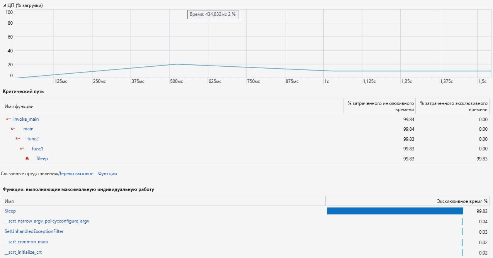
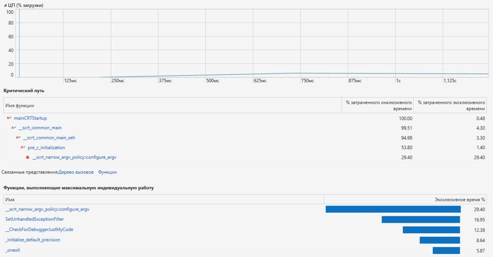
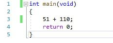
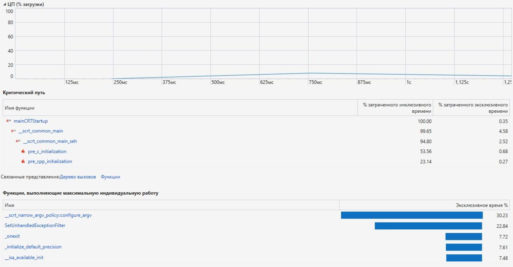

# OS-lab6-profiling

We will use Visual Studio for profiling.

This is result for initial program:

As we can see function "sleep" takes the most time

Also we can see that all that this program is doing - is summing two numbers, so we can delete all redundant code. After that we get this:

